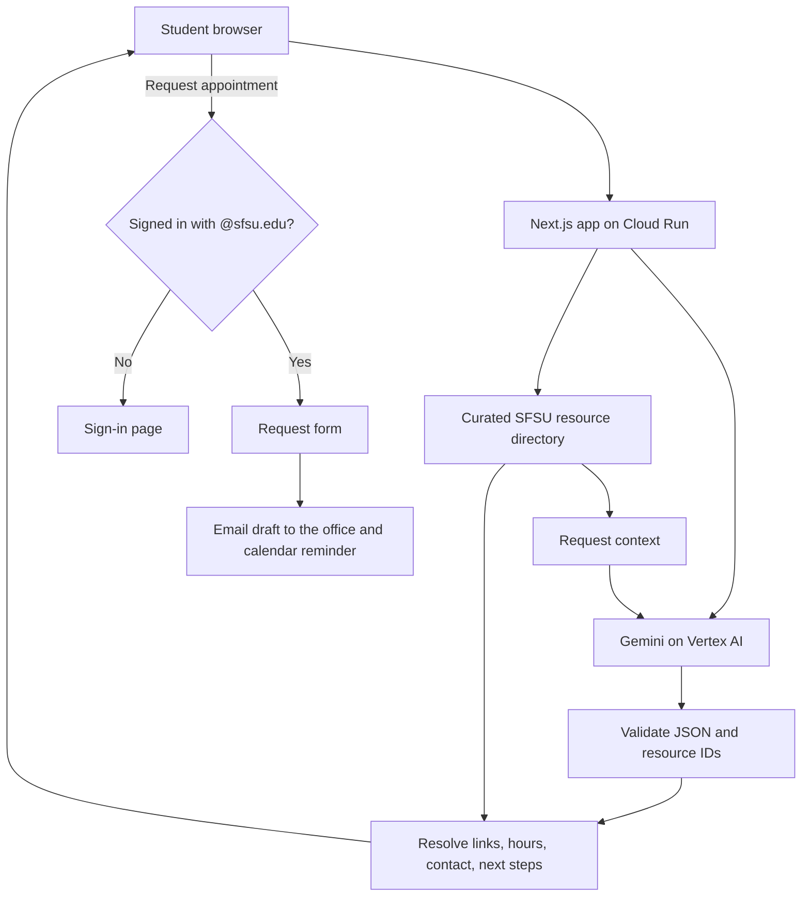

# GatorResource — Architecture

## Purpose and scope

This document describes the MVP as built. The application maps a student's plain-language description to a small directory of official SFSU support resources, shows verified office information for each, and lets signed-in students prepare an appointment request. It is a resource navigator, not a general-purpose chatbot, an eligibility decision system, or an official SFSU booking system.

This is a design description, not evidence that live Gemini access, deployment, or Cloud credit usage has been verified.

## Stack

| Component | Choice | Purpose |
| --- | --- | --- |
| Language | TypeScript | Typed data, validation, and UI |
| Framework | Next.js (App Router) and React | Server-rendered pages, server actions, and a route handler for search |
| AI | Gemini on Vertex AI (global endpoint) | Interpret needs, rank resources, and explain constraints |
| AI credentials | Application Default Credentials via `google-auth-library` | No API key in the app; Cloud Run supplies a service-account identity |
| Resource storage | `data/resources.json` | A small, reviewable directory with no database |
| Sign-in | Signed, HTTP-only session cookie (HMAC) | Gate appointment requests to `@sfsu.edu` addresses |
| Hosting | Google Cloud Run (Dockerfile, listens on `PORT`) | Run the container and use an additional Google service |
| Validation | Server-side schema and ID checks | Reject unusable or unverified recommendations |
| Styling | Plain CSS in `app/globals.css` | Rounded, three-color design (deep green, lime, warm paper) |

The Gemini model ID is configuration (`GEMINI_MODEL`), not a permanent assumption. Verify structured-output support and access with the project before relying on it.

## System diagram



Browsing and search are open to everyone. The browse view reads the directory directly and does not call Gemini. Official links open the university's pages. The app does not submit applications, contact offices, or book appointments for the student.

## Project layout

```text
app/
  layout.tsx, globals.css   Shell, fonts, and styles (fixed shared background)
  page.tsx                  Home (server component): reads the session, renders the portal
  portal.tsx                Search, results, and directory UI (client component)
  logo.tsx, icons.tsx       Logo and single-color line icons
  icon.svg                  Browser-tab icon
  login/                    Sign-in page, form, and server actions (login, logout)
  book/[id]/                Appointment request page and form (sign-in required)
  api/match/route.ts        Search endpoint (POST)
  api/health/route.ts       Health check
lib/
  matching.ts               Prompt, response schema, Gemini call, validation
  vertex.ts                 Vertex endpoint and ADC headers
  resources.ts              Typed access to the directory
  session.ts                Session cookie and @sfsu.edu check
data/resources.json         Verified resource directory
tests/matching.test.ts      Mocked tests
scripts/                    Environment and live Gemini checks
Dockerfile                  Cloud Run container configuration
```

## Directory data contract

Each record contains:

| Field | Meaning |
| --- | --- |
| `id` | Unique, stable identifier used by the model |
| `name` | Resource's public name |
| `category` | Topic used for browsing and icons |
| `description` | Concise description grounded in an official source |
| `nextStep` | A concrete action supported by that source |
| `availability` | What is known and unknown about program hours and appointments |
| `eligibility` | Published audience or requirements, without a student-specific decision |
| `sourceUrl` | Official destination for the student |
| `reviewedAt` | Date the source was reviewed, in `YYYY-MM-DD` format |
| `contact.officeHours` | Office hours as stated on the official page, or a statement that they were not listed |
| `contact.location` | Building and room or address as stated on the official page |
| `contact.phone` | Phone number from the official page |
| `contact.email` | Contact email from the official page |

Office hours, program hours, and appointment availability are different facts. `contact.officeHours` never establishes that a program (food distribution, pharmacy, classes, and so on) is open; `availability` says what remains unknown.

Current coverage (23 resources): Basic Needs and housing navigation, University Housing, career support, counseling, student health, disability access, tutoring, advising, EOP, library, financial aid, registrar, IT help, parking and transportation, dean of students, veterans services, international education, campus recreation, university police, Title IX, student conduct, and graduate studies. Verify all facts against official pages before adding or changing records. Do not create synthetic entries.

## Search flow

1. Accept a nonempty description of at most 2,000 characters; the route also limits the request body size.
2. Check that the Vertex project and credentials are configured.
3. Clear any previous displayed result and show a loading state.
4. Send the description (as a separate, labeled student input), the directory, matching instructions, and the response schema to Gemini.
5. Ask for up to three useful matches, considering multiple needs and constraints.
6. Parse and validate the response. Reject unknown IDs, extra fields, links, and invalid types; remove duplicates.
7. Resolve names, links, next steps, hours, and contact details from the directory.
8. Render cards with clearly labeled AI explanations and verified source details.
9. Display uncovered needs and optionally offer a plain-text download.

The whole directory fits in the request, so embeddings and a vector database are unnecessary at this scale. As the directory grows, watch request size and consider retrieval.

## Model response contract

```json
{
  "matches": [
    {
      "resourceId": "basic-needs",
      "reason": "This resource may help with the grocery need you described.",
      "constraintNote": "Tuesday program availability needs confirmation."
    }
  ],
  "uncoveredNeeds": []
}
```

This is an illustrative shape, not a verified model result. `resourceId` is restricted to the current directory IDs in the response schema and validated again on the server. At most three matches and six uncovered needs are accepted. Explanation text containing links, markup, or domain names is rejected.

The model must not generate destination URLs or replace directory facts. A valid ID does not guarantee a correct explanation, so generated reasoning keeps a visible AI label.

## Sign-in and appointment requests

- **Sign-in.** `/login` accepts only `name@sfsu.edu` (lowercased; no subdomains, extra `@`, or odd characters). A server action sets a signed, HTTP-only, same-site cookie (HMAC-SHA256 with `SESSION_SECRET`; eight-hour expiry; `secure` in production). Redirect targets after sign-in must be same-site paths.
- **What this is not.** The check is on email format and domain only. It does not prove the person owns the inbox, so it is not secure identity verification. Real verification would use Google Sign-In restricted to `sfsu.edu` or an emailed one-time code.
- **Open vs. gated.** The home page, directory, and `/api/match` are open. `/book/[id]` redirects signed-out visitors to `/login?next=...`.
- **Request flow.** The student chooses a weekday from tomorrow onward, a time of day (not specific slots, because the app has no calendar data), a format, and an optional short note. The app builds a pre-filled `mailto:` draft to the office's verified address and an `.ics` reminder. The student sends the email from their own account.
- **Not a booking.** The app cannot see office calendars, confirm times, or integrate with university scheduling systems. The page says it is a request and links to each official page.

## Failure behavior

| Condition | Application response |
| --- | --- |
| Empty or oversized input | Ask the student to revise; do not call Gemini |
| Missing project or credentials | Explain setup is incomplete and keep directory browsing available |
| No relevant resource | Show no match, acknowledge the limited directory, and allow browsing |
| Unsupported availability constraint | Explain uncertainty; do not promise access |
| Invalid or unknown resource ID | Reject the result and offer retry |
| Malformed or incomplete response | Show a readable retry message |
| Quota or network failure | Explain the failure without exposing credentials or raw errors |
| New search or edited input | Abort the old request and clear old cards so they are not shown as an answer |
| Signed-out appointment request | Redirect to sign-in, then return to the request page |
| Weekend or past date in a request | Show an inline message and do not continue |

Search uses a bounded timeout (30 seconds in the browser). There are no unlimited automatic retries.

## State, privacy, and trust boundaries

- Search text and results live in temporary React state. No application database is required, and search text is not logged.
- The only persisted item is the signed session cookie holding the signed-in email. Appointment details exist only in the browser and in the email the student sends.
- Disclose that a search sends the description to Google. Avoid collecting identifiers or sensitive records; the forms tell students to leave out IDs and private details.
- Keep secrets out of resource data, source control, the Docker build context, error messages, and downloads.
- Describe provider retention separately from application storage; do not claim zero retention.
- Student input and model output are untrusted. Only the curated directory supplies links, hours, and factual next steps.
- Do not send messages, book appointments, or apply for benefits on a student's behalf.
- Search is open, so a public deployment lets anyone use the Gemini quota. Set quotas and watch billing.

## Design system

Three colors: deep green (`#294e3b`), soft lime (`#ddecac`), and warm paper (`#f8f9f5`), with dark neutral ink. Fonts are Bricolage Grotesque for headings and the wordmark and Figtree for body text. Rounded cards and pill controls, single-color line icons, and one fixed, light, shared background across all pages. Body text is 16px, and controls have visible focus states. Keyboard and screen-reader behavior should be tested before claiming accessibility compliance.

## Deployment and track evidence

The Dockerfile builds a standalone Next.js server that binds to `0.0.0.0` and the assigned `PORT`. Deploy to the Google Cloud project associated with the hackathon credits, with a dedicated runtime service account that has the Vertex AI User role. Set `GOOGLE_CLOUD_PROJECT`, `GOOGLE_CLOUD_LOCATION=global`, `GEMINI_MODEL`, and a stable `SESSION_SECRET` (preferably from Secret Manager).

Capture the deployed URL, a successful live request, and evidence of credited project usage. A Dockerfile, an unused credit grant, or a local-only demo does not establish completion of the GDG requirements.

## Validation and future growth

Mocked tests check validation, error handling, request limits, and directory integrity (including office hours, location, phone, and email on every record). They do not verify live model quality or access. Test live: food plus career, online academic support, impossible schedule constraints, irrelevant requests, and attempts to invent resources.

After the hackathon, a campus pilot could add real identity verification, an office-owned directory with refresh reminders, official scheduling integrations where offices agree, privacy-reviewed feedback, per-user rate limits, and broader accessibility testing. A database becomes useful when multiple staff update resources or when appointment tracking is needed; it is not required for this MVP.
